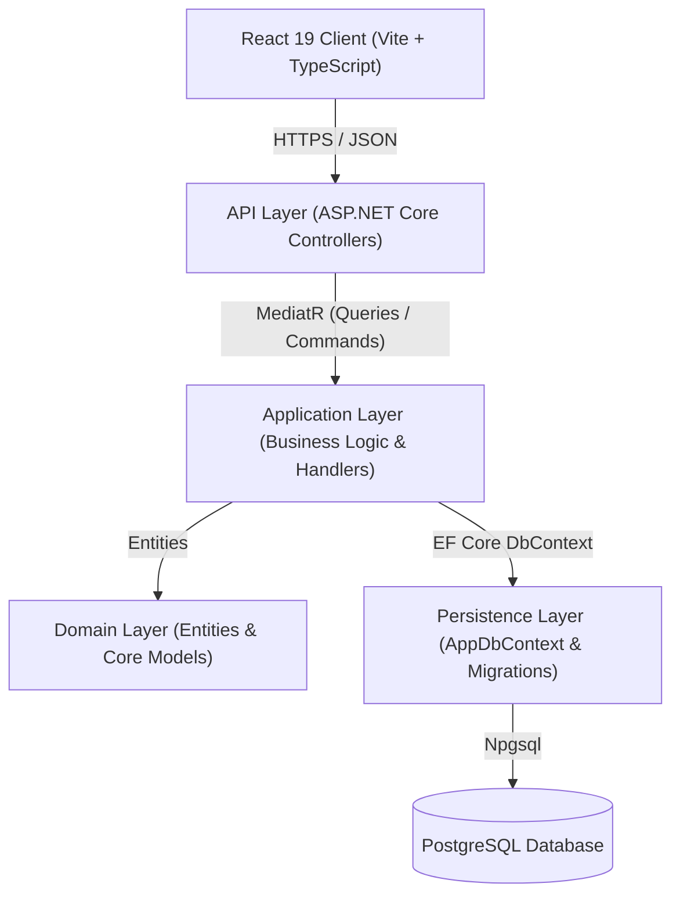

# Reactivities - Full-Stack .NET & React Application

A modern, full-stack web application for organizing, browsing, and managing social and community activities. Built using **Clean Architecture** and the **CQRS** pattern on the backend with **ASP.NET Core** and **PostgreSQL**, paired with a high-performance **React 19**, **TypeScript**, and **Material UI** frontend powered by **TanStack Query**.

---

## 📑 Table of Contents

- [Architecture Overview](#-architecture-overview)
- [Tech Stack](#-tech-stack)
- [Key Features](#-key-features)
- [Project Structure](#-project-structure)
- [Prerequisites](#-prerequisites)
- [Getting Started](#-getting-started)
  - [1. Backend Setup](#1-backend-setup)
  - [2. Frontend Setup](#2-frontend-setup)
- [API Endpoints](#-api-endpoints)
- [Scripts & Commands](#-scripts--commands)

---

## 🏛 Architecture Overview

The backend is built following **Clean Architecture / Onion Architecture** principles with clear separation of concerns, alongside the **CQRS (Command Query Responsibility Segregation)** pattern:



- **Domain Layer**: Contains enterprise entities (e.g., `Activity`) with zero external dependencies.
- **Application Layer**: Contains business logic, MediatR Queries & Commands (CQRS), and AutoMapper profiles.
- **Persistence Layer**: Houses Entity Framework Core `AppDbContext`, database migrations, and automatic database seeders (`DbInitializer`).
- **API Layer**: Exposes RESTful HTTP endpoints, manages CORS policies, OpenAPI specifications, dependency injection, and application lifecycle.
- **Client (Frontend)**: Modular React 19 single-page application (SPA) with feature-based directory structure, server state management via TanStack React Query, and Material UI.

---

## 💻 Tech Stack

### Backend
| Technology | Description |
| :--- | :--- |
| **C# / .NET** | High-performance backend runtime (`net11.0` / ASP.NET Core) |
| **PostgreSQL** | Relational database engine |
| **Entity Framework Core** | Modern object-relational mapper (`Npgsql.EntityFrameworkCore.PostgreSQL`) |
| **MediatR** | In-process messaging mediator implementing CQRS handlers |
| **AutoMapper** | Convention-based object-to-object mapping |
| **OpenAPI / Swagger** | API contract and documentation generation |

### Frontend
| Technology | Description |
| :--- | :--- |
| **React 19** | Modern UI library utilizing modern hooks and concurrent features |
| **TypeScript** | Static typing across all components, hooks, and API agents |
| **Vite** | Fast frontend build tool and development server |
| **Material UI (MUI)** | Component library and styling system (`@mui/material`, `@emotion`) |
| **TanStack Query v5** | Server-state synchronization, caching, and data fetching |
| **Axios** | HTTP client with response interceptors and simulated latency |
| **React Hook Form & Zod** | Form management with type-safe schema validation |

---

## ✨ Key Features

- **Activity Management (CRUD)**:
  - View activities with category badges, dates, descriptions, and locations.
  - View detailed information for a single activity.
  - Create new activities with client-side validation.
  - Edit existing activity details.
  - Delete activities.
- **Server-State Caching & Optimizations**:
  - Seamless data fetching with TanStack Query.
  - Loading skeleton and pending states during queries.
- **Realistic Network Latency Simulation**:
  - Centralized Axios `agent` with custom response interceptor providing simulated delay (`sleep(1000)`) for smooth UI loading testing.
- **Database Auto-Migration & Seeding**:
  - Automatically applies pending Entity Framework Core migrations and seeds initial sample activities on application startup.
- **CORS Configured**:
  - Configured to securely permit connections from development clients (`localhost:5173`, `localhost:3000`).

---

## 📂 Project Structure

```text
FullStackDotNEtREACT/
├── API/                              # ASP.NET Core Web API Project
│   ├── Controllers/                  # REST API Controllers (ActivitiesController)
│   ├── Extensions/                   # Service & Migration extensions
│   ├── Options/                      # Strongly-typed configuration options
│   ├── Program.cs                    # Application entry point & middleware pipeline
│   └── appsettings.Development.json  # Development configuration & connection strings
├── Application/                      # Application Business Logic (CQRS)
│   ├── Activities/
│   │   ├── Commands/                 # CreateActivity, EditActivity, DeleteActivity
│   │   └── Queries/                  # GetActivityList, GetActivityDetails
│   └── Core/                         # MappingProfiles (AutoMapper)
├── Domain/                           # Core Domain Entities
│   └── Activity.cs                   # Activity entity
├── Persistence/                      # Data Access Layer
│   ├── AppDbContext.cs               # EF Core Database Context
│   ├── DbInitializer.cs              # Initial sample data seeder
│   └── Migrations/                   # EF Core Code-First Migrations
└── client/                           # React + TypeScript Frontend
    ├── src/
    │   ├── App/
    │   │   └── Layout/               # App shell, Navbar, global styles
    │   ├── Feature/
    │   │   └── activites/            # Activities feature module
    │   │       ├── Dashboard/        # ActivityDashboard, ActivityList, ActivityCard
    │   │       ├── Details/          # ActivityDetails view
    │   │       └── Form/             # ActivityForm component
    │   ├── lib/
    │   │   ├── Api/                  # Axios agent instance and interceptors
    │   │   ├── Hooks/                # Custom React hooks (useactivites)
    │   │   ├── schemas/              # Zod validation schemas
    │   │   └── Types/                # TypeScript interface definitions
    │   └── main.tsx                  # React DOM root and QueryClientProvider
    └── package.json                  # Frontend dependencies and scripts
```

---

## ⚙️ Prerequisites

Before running the project locally, ensure you have the following installed:

1. **.NET SDK** (version 10 or 11 preview): [Download .NET](https://dotnet.microsoft.com/download)
2. **Node.js** (v18 or higher) & **npm**: [Download Node.js](https://nodejs.org/)
3. **PostgreSQL** (running locally or in Docker): [Download PostgreSQL](https://www.postgresql.org/)

---

## 🚀 Getting Started

### 1. Backend Setup

1. **Configure Database Connection**:
   Open [`API/appsettings.Development.json`](file:///c:/Users/ahmed/OneDrive/Desktop/FullStackDotNEtREACT/API/appsettings.Development.json) and configure your PostgreSQL connection string:
   ```json
   "ConnectionStrings": {
     "DefaultConnection": "Host=localhost;Port=5432;Database=reactivities;Username=postgres;Password=your_password"
   }
   ```

2. **Run the API**:
   From the project root:
   ```bash
   dotnet run --project API
   ```
   > The application will automatically execute database migrations and seed sample data on first run.

3. **Backend URLs**:
   - HTTPS: `https://localhost:7223`
   - HTTP: `http://localhost:5096`
   - OpenAPI Docs: `https://localhost:7223/openapi/v1.json`

---

### 2. Frontend Setup

1. **Navigate to the client directory**:
   ```bash
   cd client
   ```

2. **Install Dependencies**:
   ```bash
   npm install
   ```

3. **Start the Development Server**:
   ```bash
   npm run dev
   ```

4. **Access the Application**:
   Open [http://localhost:5173](http://localhost:5173) in your browser.

---

## 📡 API Endpoints

The API exposes the following endpoints under `/api/activities`:

| Method | Endpoint | Description | Request Body |
| :--- | :--- | :--- | :--- |
| **GET** | `/api/activities` | Retrieve all activities | None |
| **GET** | `/api/activities/{id}` | Retrieve details for a specific activity | None |
| **POST** | `/api/activities` | Create a new activity | `Activity` JSON object |
| **PUT** | `/api/activities/{id}` | Update an existing activity | `Activity` JSON object |
| **DELETE** | `/api/activities/{id}` | Delete an activity | None |

---

## 🛠 Scripts & Commands

### Backend (`/`)
- `dotnet build`: Build the entire .NET solution.
- `dotnet run --project API`: Start the backend server.
- `dotnet watch --project API`: Start the backend with hot reload.
- `dotnet ef database update -p Persistence -s API`: Manually apply Entity Framework migrations.

### Frontend (`/client`)
- `npm run dev`: Launch the Vite development server with Hot Module Replacement (HMR).
- `npm run build`: Compile TypeScript and build the production bundle.
- `npm run lint`: Run the `oxlint` linter for fast static analysis.
- `npm run preview`: Locally preview the production build.